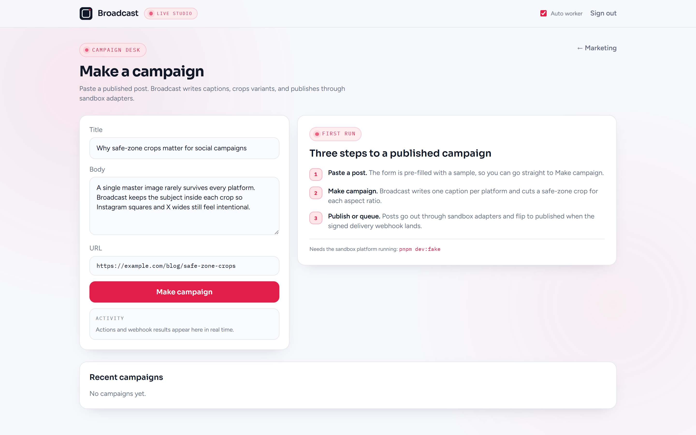
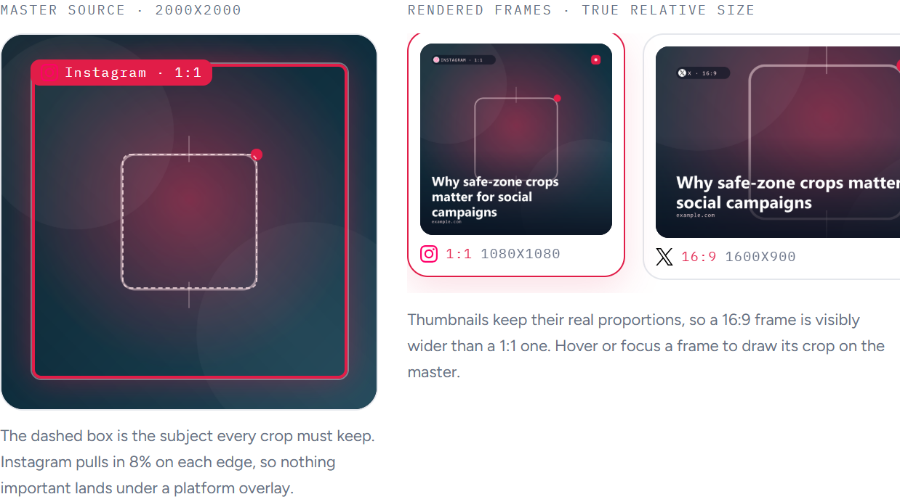
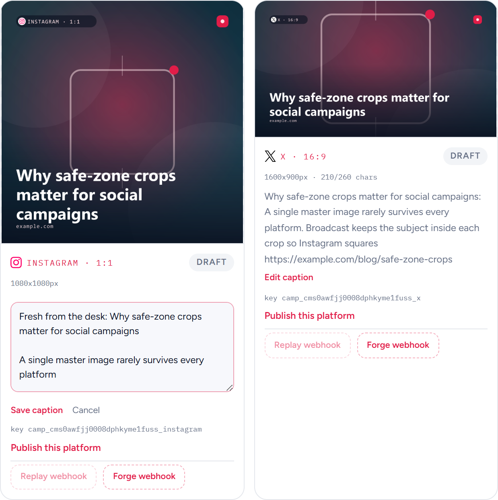
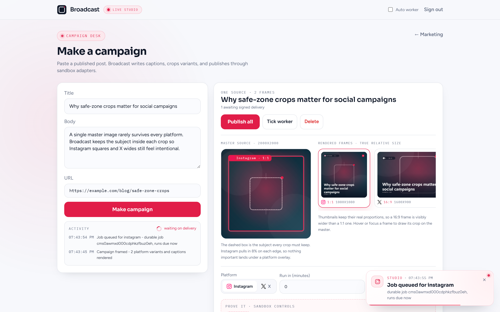
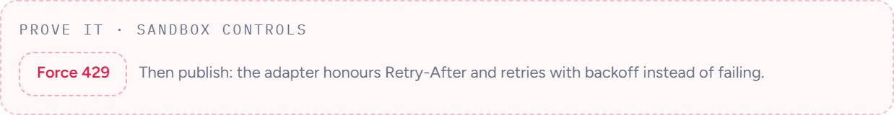
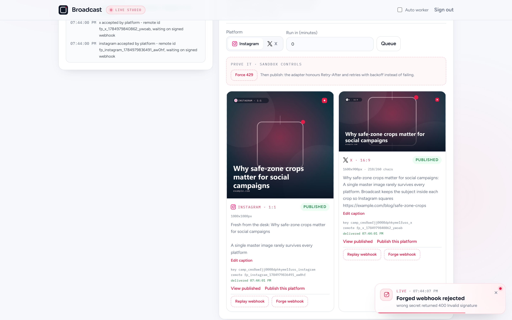

# Broadcast

### One blog post. Every frame ready.

Marketing wants the same story on Instagram and X today. Engineering knows what that actually means: different crops, different captions, encrypted tokens, retries that must not double-post, rate limits that must back off, and delivery status that only flips when a signed webhook says so.

Broadcast is that studio. Paste a published post, get platform-sized variants and fragment-composed captions, then publish through a `SocialPublisher` adapter layer against a **local fake platform**. No live Instagram, X, or LinkedIn calls for the core build.

**Run locally:** [Quick start](#quick-start) | [Prove it yourself](#prove-it-yourself) | [Architecture](docs/ARCHITECTURE.md)


## Why Broadcast

- **Fragment captions:** shared openers plus platform voice fragments so Instagram and X never get near-identical copy.
- **Real artwork, not placeholders:** each campaign renders its own master image, then burns a caption card with the post title, platform, aspect, and source domain into every variant.
- **Safe-zone variants:** one source becomes 1:1 (1080×1080) and 16:9 (1600×900) with the subject kept inside the crop inset, asserted by a test rather than claimed.
- **Adapter layer:** app code depends on `SocialPublisher`, never a vendor SDK. Instagram and X adapters hit the fake server only.
- **Encrypted tokens:** AES-256-GCM with a random IV on every credential write.
- **Idempotent publish:** the same `(campaign, platform)` key yields one remote post, even on retry.
- **429 aware:** adapters honor `Retry-After` and back off before continuing.
- **Durable schedule:** SQLite-backed jobs with claim locks; a crash mid-batch resumes without double-posting.
- **Signed delivery:** forged webhooks return `400`; valid ones flip `queued -> published | failed`.


## Campaign desk

A first visit does not drop you on an empty board. Three steps tell you exactly what to press, and the form arrives pre-filled so **Make campaign** works immediately.



Sign in with the demo API key and paste a post. One source image becomes two frames: a 1:1 Instagram render and a 16:9 X render, each previewed at its true aspect ratio with its own caption, pixel size, and character budget.


### One source, every frame

The crop is not a claim in the copy, it is drawn on the master image. The dashed box is the subject every crop has to keep, the rose box is the region a platform actually takes, and the rail on the right holds the rendered frames at their true relative size, so a 16:9 render is visibly wider than a 1:1 one. Hover a frame to pin its crop. The overlay and the render pipeline share one `computeCrop` implementation, and a test asserts they agree.



### Editable captions

Generated copy is a starting point, not a verdict. Edit either caption in place and save. The idempotency key never changes, so republishing edited copy is a replay against the platform rather than a second remote post.



Nothing happens silently. Queue a platform and the durable job id, the countdown, a spinner on the queued row, and a toast all say so. Switch **Auto worker** off to hold a job in the queue and inspect it.



When the fake platform returns a signature-verified delivery webhook, the row flips to published and the activity log records the remote post id and the delivery time.


### Sandbox controls

The three hardest guarantees are usually buried in a test run. Here they are buttons. **Force 429** puts the platform into rate-limited mode so the next publish visibly waits on `Retry-After`. **Replay webhook** asks the platform to re-send the same signed delivery, and the row stays published instead of duplicating. **Forge webhook** sends a well-formed payload signed with the wrong secret to the real webhook route, which answers `400 Invalid signature` and leaves the status untouched.





## Auth choice

**Seeded demo API key**, same pattern as other Capstones: zero mail setup, real HTTP-only session cookie (`broadcast_session`).

| Role | API key |
| --- | --- |
| Studio demo | `broadcast_demo_key_001` |

## Quick start

### Prerequisites

- Node.js 18.18 or newer
- pnpm 9 or newer
- Git

### Clone, install, seed, and run

Clone the repository first, then install and start the app:

```bash
git clone https://github.com/yuan05-afk/flyrank-capstone-broadcast.git
cd flyrank-capstone-broadcast
pnpm install
pnpm db:push
pnpm db:seed
```

In one terminal, start the fake platform (required for publish, webhooks, and most tests):

```bash
pnpm dev:fake
# http://localhost:4100
```

In another terminal:

```bash
pnpm dev
# http://localhost:3000
```

Open `http://localhost:3000`, sign in with `broadcast_demo_key_001`, then **Make a campaign**.

Copy `.env.example` to `.env` if you need local overrides. `APP_WEBHOOK_BASE_URL` must match the Next.js origin so the fake platform can deliver status (default `http://localhost:3000`). Restart `pnpm dev:fake` after changing it.

### Optional durable worker loop

```bash
pnpm dev:worker
```

Or trigger one claim from the campaign desk (**Tick worker**) / `POST /api/worker/tick`.

## Prove it yourself

**Variants and captions**

```bash
pnpm test
```

Eight checks: Instagram/X output dimensions, the subject staying inside both platform crops, the desk overlay matching the crop the pipeline cuts, caption edits preserving the idempotency key, distinct fragment captions, webhook signature accept and reject, idempotent publish, and 429 backoff (fake platform must be running).

Render a pair of variants without the app:

```bash
pnpm preview:variants
# storage/variants/preview-check/{instagram,x}.png
```

**Idempotent publish**

Create a campaign in the UI, publish Instagram twice. The fake platform keeps one remote post for that idempotency key. The Vitest suite covers the same path against `:4100`.

**Forged webhook**

Press **Forge webhook** on any post card, or from the shell:

```bash
curl -s -o /dev/null -w "%{http_code}\n" \
  -H "Content-Type: application/json" \
  -H "x-broadcast-signature: deadbeef" \
  -d '{"externalPostId":"x","idempotencyKey":"k","platform":"instagram","status":"published"}' \
  http://localhost:3000/api/webhooks/social-delivery
# 400
```

**Schedule + worker**

Switch **Auto worker** off, queue a platform with **Run in (minutes) = 0**, and the row sits at `queued` with its durable job id. Press **Tick worker**: the job claims, publishes once, and the signed delivery webhook flips status to `published`. Leaving Auto worker on runs the same claim loop every three seconds.

**Force 429**

Press **Force 429** in the sandbox controls panel, or from the shell:

```bash
curl -s -X POST http://localhost:4100/admin/force-429 \
  -H "Content-Type: application/json" \
  -d '{"enabled":true}'
```

Publish again; the adapter waits on `Retry-After`. Disable with `"enabled":false` when done.

## Architecture

```
blog post
  -> caption fragments + image variants
  -> SocialPost (draft)
  -> schedule / publish
  -> durable Job
  -> SocialPublisher (InstagramAdapter | XAdapter)
  -> fake platform (:4100)
  -> signed webhook
  -> status published | failed
```

Layers stay `repository -> service -> route handler`. See [docs/ARCHITECTURE.md](docs/ARCHITECTURE.md), [docs/FAKE_PLATFORM.md](docs/FAKE_PLATFORM.md), and the sequence diagram in [docs/diagram.md](docs/diagram.md).

## Design

Broadcast Frame: rose accent `#E11D48`, Sora + Figtree, crop-frame + live-corner mark. Shared Capstones harness (Lenis, Framer Motion, L/R hero). Details in [docs/DESIGN.md](docs/DESIGN.md).

## Demo script

1. Start from a blog post -> **Make campaign**
2. Hover the frame rail to show one source becoming a 1:1 and a 16:9 crop
3. Edit a caption -> save -> show the idempotency key did not move
4. Schedule one for later -> tick worker
5. Publish twice -> one remote post
6. **Force 429** -> publish -> watch backoff
7. **Forge webhook** (`400`, status untouched), then **Replay webhook** (still one remote post)
8. Close on a green board - zero real accounts touched

## Stack

Next.js 14 · TypeScript · Prisma/SQLite · Zod · Vitest · sharp · pnpm

## License

Built as a FlyRankAI Capstone. Sandbox-first: no production social credentials in this repo.

