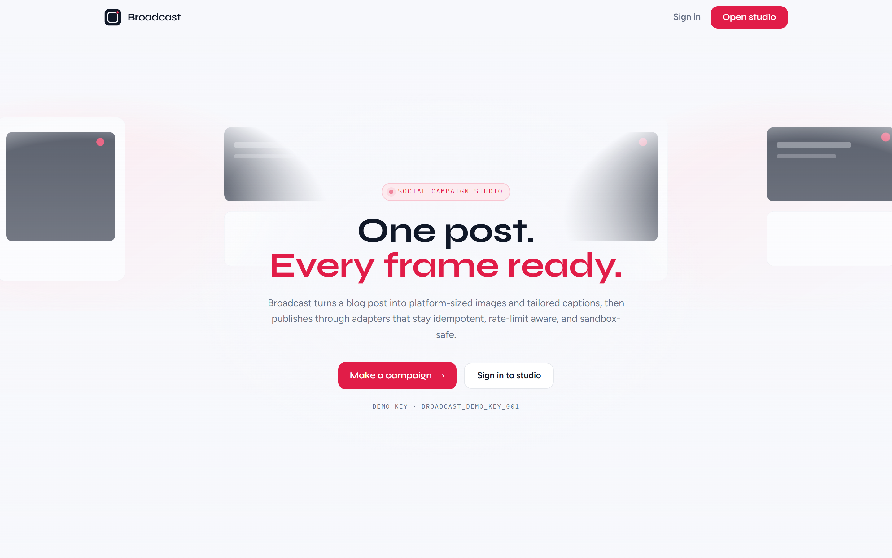
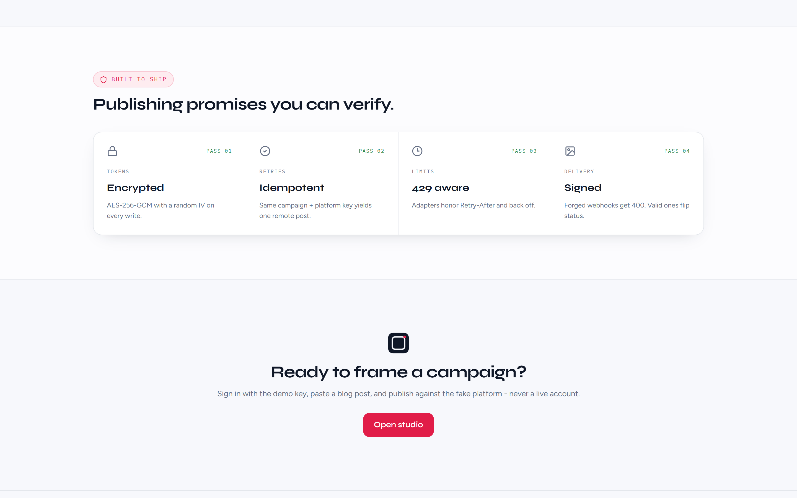
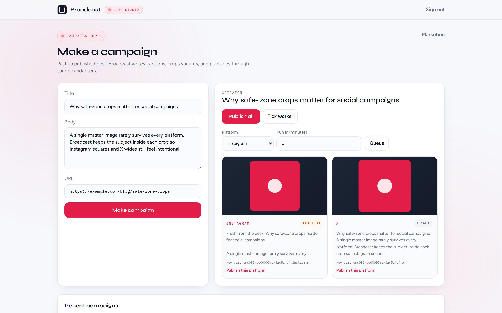
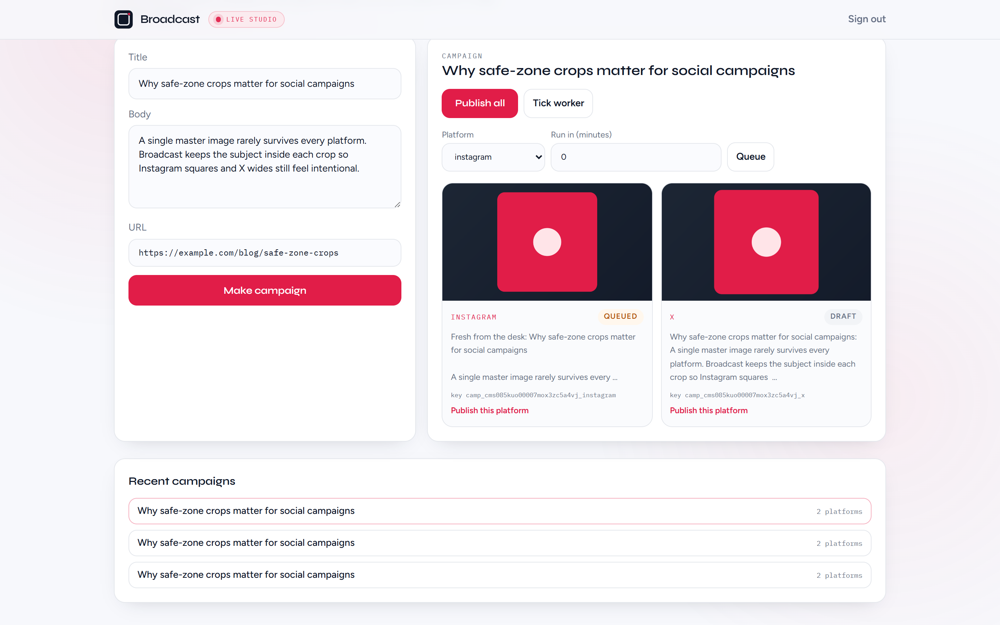

# Broadcast

### One blog post. Every frame ready.

Marketing wants the same story on Instagram and X today. Engineering knows what that actually means: different crops, different captions, encrypted tokens, retries that must not double-post, rate limits that must back off, and delivery status that only flips when a signed webhook says so.

Broadcast is that studio. Paste a published post, get platform-sized variants and fragment-composed captions, then publish through a `SocialPublisher` adapter layer against a **local fake platform**. No live Instagram, X, or LinkedIn calls for the core build.

**Run locally:** [Quick start](#quick-start) | [Prove it yourself](#prove-it-yourself) | [Architecture](docs/ARCHITECTURE.md)



## Why Broadcast

- **Fragment captions:** shared openers plus platform voice fragments so Instagram and X never get near-identical copy.
- **Safe-zone variants:** one source becomes 1:1 (1080×1080) and 16:9 (1600×900) with the subject kept inside the crop inset.
- **Adapter layer:** app code depends on `SocialPublisher`, never a vendor SDK. Instagram and X adapters hit the fake server only.
- **Encrypted tokens:** AES-256-GCM with a random IV on every credential write.
- **Idempotent publish:** the same `(campaign, platform)` key yields one remote post, even on retry.
- **429 aware:** adapters honor `Retry-After` and back off before continuing.
- **Durable schedule:** SQLite-backed jobs with claim locks; a crash mid-batch resumes without double-posting.
- **Signed delivery:** forged webhooks return `400`; valid ones flip `queued -> published | failed`.



## Campaign desk

Sign in with the demo API key, paste a post, and open the board. Each platform row shows its cropped thumb, tailored caption, status pill, and idempotency key. Queue a run for later or publish now, then tick the worker.





After the fake platform delivers a signed webhook, the row turns published.


## Auth choice

**Seeded demo API key**, same pattern as other Capstones: zero mail setup, real HTTP-only session cookie (`broadcast_session`).

| Role | API key |
| --- | --- |
| Studio demo | `broadcast_demo_key_001` |

## Quick start

### Prerequisites

- Node.js 18.18 or newer
- pnpm 9 or newer
- Git

### Clone, install, seed, and run

Clone the repository first, then install and start the app:

```bash
git clone https://github.com/yuan05-afk/flyrank-capstone-broadcast.git
cd flyrank-capstone-broadcast
pnpm install
pnpm db:push
pnpm db:seed
```

In one terminal, start the fake platform (required for publish, webhooks, and most tests):

```bash
pnpm dev:fake
# http://localhost:4100
```

In another terminal:

```bash
pnpm dev
# http://localhost:3000
```

Open `http://localhost:3000`, sign in with `broadcast_demo_key_001`, then **Make a campaign**.

Copy `.env.example` to `.env` if you need local overrides. `APP_WEBHOOK_BASE_URL` must match the Next.js origin so the fake platform can deliver status (default `http://localhost:3000`). Restart `pnpm dev:fake` after changing it.

### Optional durable worker loop

```bash
pnpm dev:worker
```

Or trigger one claim from the campaign desk (**Tick worker**) / `POST /api/worker/tick`.

## Prove it yourself

**Variants and captions**

```bash
pnpm test
```

Asserts Instagram/X dimensions, distinct fragment captions, webhook signature reject/accept helpers, idempotent publish, and 429 backoff (fake platform must be running).

**Idempotent publish**

Create a campaign in the UI, publish Instagram twice. The fake platform keeps one remote post for that idempotency key. The Vitest suite covers the same path against `:4100`.

**Forged webhook**

```bash
curl -s -o /dev/null -w "%{http_code}\n" \
  -H "Content-Type: application/json" \
  -H "x-broadcast-signature: deadbeef" \
  -d '{"externalPostId":"x","idempotencyKey":"k","platform":"instagram","status":"published"}' \
  http://localhost:3000/api/webhooks/social-delivery
# 400
```

**Schedule + worker**

Queue a platform with **Run in (minutes) = 0**, then **Tick worker**. The job claims, publishes once, and the signed delivery webhook flips status to `published`.

**Force 429**

```bash
curl -s -X POST http://localhost:4100/admin/force-429 \
  -H "Content-Type: application/json" \
  -d '{"enabled":true}'
```

Publish again; the adapter waits on `Retry-After`. Disable with `"enabled":false` when done.

## Architecture

```
blog post
  -> caption fragments + image variants
  -> SocialPost (draft)
  -> schedule / publish
  -> durable Job
  -> SocialPublisher (InstagramAdapter | XAdapter)
  -> fake platform (:4100)
  -> signed webhook
  -> status published | failed
```

Layers stay `repository -> service -> route handler`. See [docs/ARCHITECTURE.md](docs/ARCHITECTURE.md), [docs/FAKE_PLATFORM.md](docs/FAKE_PLATFORM.md), and the sequence diagram in [docs/diagram.md](docs/diagram.md).

## Design

Broadcast Frame: rose accent `#E11D48`, Syne + Figtree, crop-frame + live-corner mark. Shared Capstones harness (Lenis, Framer Motion, L/R hero). Details in [docs/DESIGN.md](docs/DESIGN.md).

## Demo script

1. Start from a blog post -> **Make campaign**
2. Show square vs wide images and different captions
3. Schedule one for later -> tick worker
4. Publish twice -> one remote post
5. Force 429 -> watch backoff
6. Fire a forged delivery webhook (`400`), then accept a valid one (`published`)
7. Close on a green board - zero real accounts touched

## Stack

Next.js 14 · TypeScript · Prisma/SQLite · Zod · Vitest · sharp · pnpm

## License

Built as a FlyRankAI Capstone. Sandbox-first: no production social credentials in this repo.
