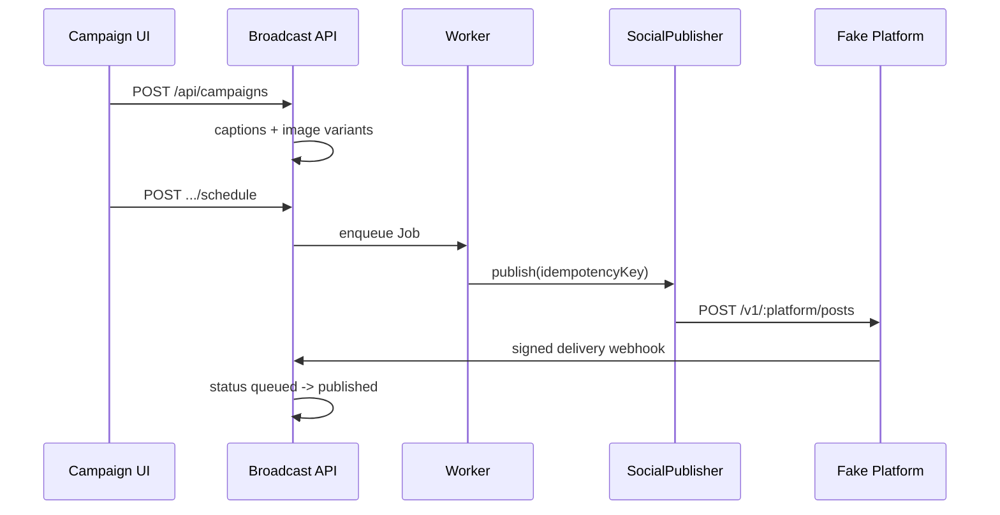

```mermaid
sequenceDiagram
  participant UI as Campaign UI
  participant API as Broadcast API
  participant W as Worker
  participant P as SocialPublisher
  participant F as Fake Platform

  UI->>API: POST /api/campaigns
  API->>API: captions + image variants
  UI->>API: POST .../schedule
  API->>W: enqueue Job
  W->>P: publish(idempotencyKey)
  P->>F: POST /v1/:platform/posts
  F->>API: signed delivery webhook
  API->>API: status queued -> published
```
